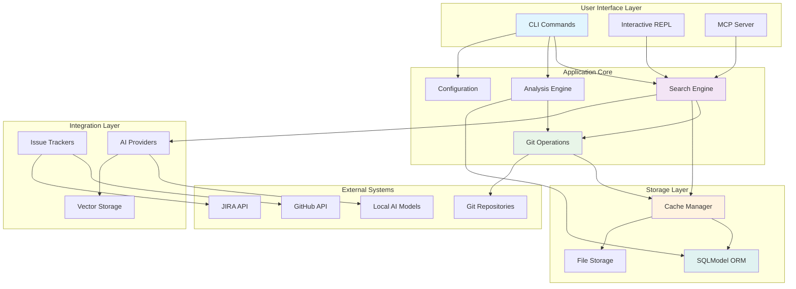
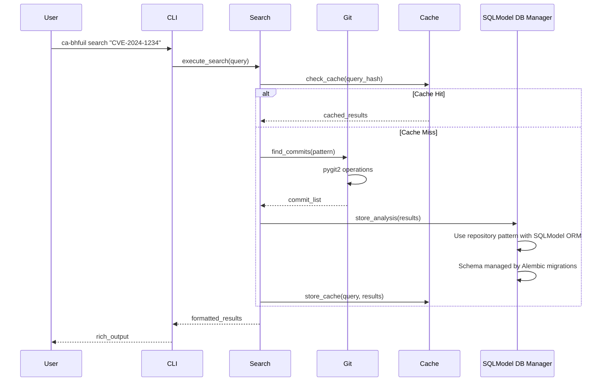
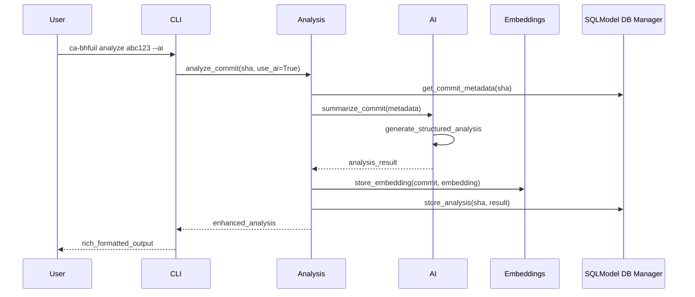

# Ca-Bhfuil Architecture Overview

> **High-level system architecture and component design**

## System Overview

Ca-Bhfuil is a **local-first git repository analysis tool** designed to help open source maintainers track commits across stable branches. The architecture prioritizes performance, offline capability, and privacy through local data storage and optional AI enhancement.

## Core Architecture Principles

### Local-First Design
- **Storage**: All data stored locally using SQLite and file-based systems
- **Performance**: Local analysis eliminates network dependencies
- **Privacy**: Repository analysis never leaves the user's machine
- **Offline Capability**: Full functionality without internet connectivity

### Performance-Oriented
- **pygit2**: LibGit2 bindings for 10x+ performance over GitPython
- **SQLite Caching**: Aggressive caching of git operations and analysis results
- **Incremental Processing**: Only analyze new commits and branches
- **Concurrent Operations**: Parallel processing where safe

### Modular Components
- **Pluggable Architecture**: Clear interfaces between components
- **Optional AI**: AI features enhance but don't replace core functionality
- **Provider Agnostic**: Support multiple git hosts and issue trackers
- **Extensible Design**: Easy addition of new search engines and analyzers

## System Components

## Component Responsibilities

### User Interface Layer

**CLI Commands**
- Command-line interface using Typer
- Rich terminal output with progress indicators
- Auto-completion and help systems
- Configuration management commands

**Interactive REPL**  
- Advanced exploration mode using prompt-toolkit
- Multi-step analysis workflows
- Context-aware command completion
- Session history and bookmarks

**MCP Server**
- Model Context Protocol server for AI integration
- Tool discovery and execution
- Remote analysis capabilities
- Standardized AI agent interface

### Application Core

**Search Engine**
- Multi-strategy commit search (SHA, pattern, semantic)
- Branch distribution analysis
- Filtering and ranking of results
- Search result caching and optimization

**Analysis Engine**
- Backport detection algorithms
- Change classification and categorization
- Commit relationship mapping
- Statistical analysis and reporting

**Git Operations**
- High-performance repository access via pygit2
- Branch and tag enumeration
- Commit traversal and analysis
- Remote repository management

**Configuration Management**
- YAML-based configuration with validation
- Environment variable integration
- Repository-specific settings
- Authentication and credentials

### Storage Layer

**Cache Manager**
- Intelligent caching strategies using diskcache
- Automatic eviction and cleanup policies
- Performance monitoring and optimization
- Cache invalidation on repository changes

**SQLModel ORM**
- Type-safe, async database access via SQLModel and SQLAlchemy
- Manages the single SQLite database (`ca-bhfuil.db`) schema through Alembic migrations
- Provides a repository pattern for clean data access
- Handles all transaction management and data integrity

**File Storage**
- Configuration file management
- Log storage and rotation
- Temporary file handling
- Export and import capabilities

### Integration Layer

**Issue Trackers**
- GitHub Issues, JIRA, Launchpad API clients
- Pattern-based issue ID extraction
- Lazy loading with aggressive caching
- Link resolution and content fetching

**AI Providers**
- Provider-agnostic AI integration
- Local model support (Ollama, vLLM, LMStudio)
- Remote model fallback (OpenRouter)
- Structured output using Pydantic schemas

**Vector Storage**
- SQLite-based embedding storage
- Semantic search capabilities
- Incremental embedding generation
- Provider-agnostic embedding APIs

## Data Flow Architecture

### Repository Analysis Flow

### AI-Enhanced Analysis Flow

## Key Architectural Decisions

### Storage Strategy
- **Single SQLite database for all structured data**: Analysis results, repository metadata, configuration, and embeddings in `ca-bhfuil.db`
- **Alembic-managed schema**: Database schema versioning and migration management
- **File-based for unstructured**: Logs, exports, temporary data
- **In-memory for session**: Current search context, UI state
- **External for repositories**: Git repositories managed separately

### Performance Optimizations
- **pygit2 over GitPython**: 10x+ performance improvement for git operations
- **Aggressive caching**: Multiple cache layers with intelligent invalidation
- **Lazy loading**: Issue tracker content fetched only when needed
- **Incremental analysis**: Only process new commits and changes

### AI Integration Architecture
- **Optional by design**: Core functionality works without AI
- **Provider abstraction**: Unified interface for different AI providers
- **Local preference**: Local models prioritized for privacy
- **Graceful degradation**: Fallback to non-AI analysis when needed

### Concurrency and Safety
- **Process-level locking**: Prevent concurrent repository modifications
- **Transaction management**: SQLite transactions for data consistency
- **Async operations**: Non-blocking I/O for network operations
- **Progress tracking**: User feedback for long-running operations

## System Boundaries

### Internal Components
- All code within `src/ca_bhfuil/`
- Configuration files in XDG-compliant directories
- Local SQLite databases and cache files
- Generated embeddings and analysis results

### External Dependencies
- **Git repositories**: Cloned and managed locally
- **Issue tracker APIs**: GitHub, JIRA, Launchpad (optional)
- **AI model providers**: Ollama, vLLM, OpenRouter (optional)
- **System tools**: git, ssh for repository access

### Security Boundaries
- **Authentication**: SSH keys and tokens for repository access
- **Isolation**: Each repository analyzed in isolation
- **Privacy**: Repository content never sent to external AI (configurable)
- **Permissions**: Standard filesystem permissions for data protection

## Scalability Considerations

### Repository Scale
- **Design target**: Repositories with 10k+ commits
- **Performance baseline**: Linux kernel repository
- **Memory management**: Streaming processing for large datasets
- **Storage optimization**: Compression and cleanup policies

### Feature Scale
- **Modular addition**: New search engines and analyzers
- **Plugin architecture**: External integrations without core changes
- **Configuration growth**: Hierarchical settings for complex setups
- **Output formats**: Multiple export and display formats

## Cross-References

- **Technology choices**: See [technology-decisions.md](technology-decisions.md)
- **CLI design**: See [cli-design-patterns.md](cli-design-patterns.md)  
- **Storage details**: See [data-storage-design.md](data-storage-design.md)
- **Repository management**: See [repository-management.md](repository-management.md)
- **Development process**: See [development-workflow.md](development-workflow.md)
- **Product vision**: See [project-vision.md](project-vision.md)

---

This architecture provides a solid foundation for ca-bhfuil's git analysis capabilities while maintaining flexibility for future enhancements and integrations.
