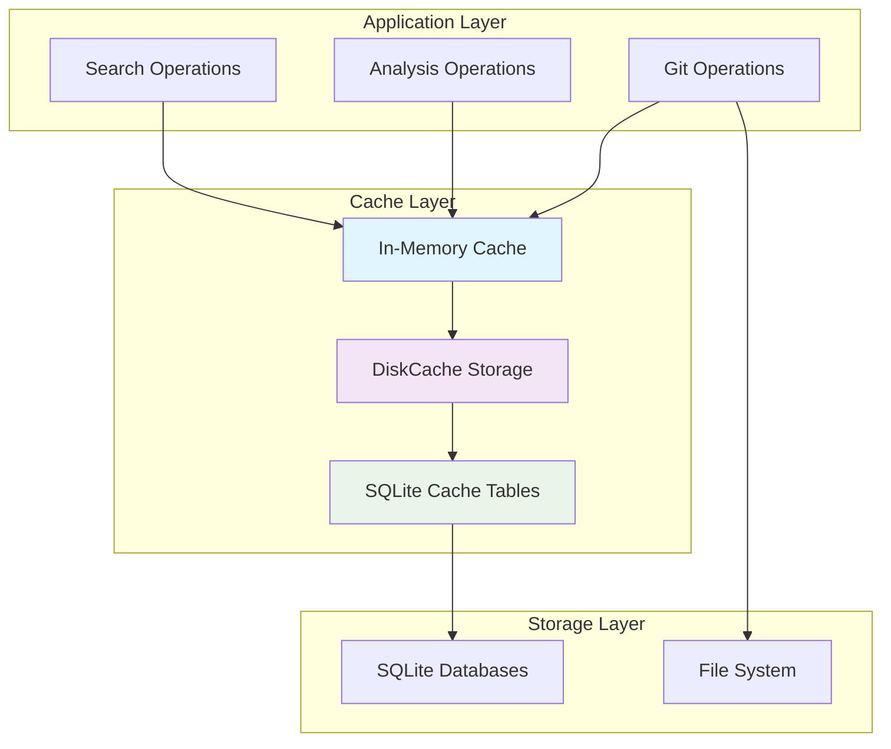

# Ca-Bhfuil Data Storage Design

> **Storage architecture, data management, and persistence strategy**

## Overview

Ca-Bhfuil implements a **local-first storage architecture** using SQLite for structured data and file-based storage for configuration and cache management. This design prioritizes performance, offline capability, and zero external dependencies while providing robust data persistence and efficient caching.

## Storage Philosophy

### Local-First Architecture
- **No External Dependencies**: All data stored locally using SQLite and filesystem
- **Offline Capable**: Complete functionality without network connectivity
- **Privacy Preserving**: Repository analysis never leaves the user's machine
- **Performance Optimized**: Local storage eliminates network latency

### XDG Base Directory Compliance
Following freedesktop.org standards for Linux compatibility:

| Directory Type | XDG Variable | Default Path | Purpose |
|---------------|--------------|--------------|---------|
| **Configuration** | `XDG_CONFIG_HOME` | `~/.config/ca-bhfuil` | User configuration files |
| **State** | `XDG_STATE_HOME` | `~/.local/state/ca-bhfuil` | Persistent application state |
| **Cache** | `XDG_CACHE_HOME` | `~/.cache/ca-bhfuil` | Cached data (can be regenerated) |

## Directory Structure

### Complete Storage Layout

```
# Configuration (Important to preserve, git-safe)
~/.config/ca-bhfuil/
├── repositories.yaml               # Repository definitions
├── global-settings.yaml            # Global application settings
└── auth.yaml                       # Authentication config (git-ignored)

# Persistent State (Important to preserve)
~/.local/state/ca-bhfuil/
├── github.com/torvalds/linux/      # Per-repository state
│   ├── analysis.db                  # SQLite: commit analysis results
│   ├── sync-log.db                  # SQLite: sync history and metadata
│   ├── embeddings.db                # SQLite: AI embeddings and vectors
│   ├── repo-config.yaml             # Repository-specific overrides
│   ├── stats.json                   # Quick access statistics
│   └── .locks/                      # Process coordination
│       ├── sync.lock
│       └── analysis.lock
├── global/
│   ├── repo-registry.db             # SQLite: global repository metadata
│   └── sync-scheduler.db            # SQLite: sync job management
└── logs/
    ├── ca-bhfuil.log               # Application logs
    └── archive/                     # Rotated log files

# Cache (Can be regenerated, storage space management)
~/.cache/ca-bhfuil/
├── repos/                          # Git repositories
│   ├── github.com/torvalds/linux/   # Cloned git repository
│   ├── github.com/django/django/
│   └── gitlab.com/fdroid/fdroidserver/
└── temp/
    ├── clone-staging/               # Temporary clone operations
    └── analysis-temp/               # Temporary analysis files
```

## SQLModel Database Design

The project has migrated from raw SQL to **SQLModel**, a modern, type-safe ORM that combines Pydantic and SQLAlchemy. This provides a single, unified data model for database schema, validation, and serialization, significantly improving maintainability and type safety.

### Schema Architecture

The database schema is now defined using SQLModel classes, which serve as the single source of truth for data structures.

#### Core Data Models (`models.py`)

```python
import datetime
import typing

import sqlalchemy
import sqlmodel


class Repository(sqlmodel.SQLModel, table=True):
    """Repository model for tracking git repositories."""
    id: int | None = sqlmodel.Field(default=None, primary_key=True)
    path: str = sqlmodel.Field(unique=True, index=True)
    name: str
    # ... other fields


class Commit(sqlmodel.SQLModel, table=True):
    """Commit model for storing git commit information."""
    id: int | None = sqlmodel.Field(default=None, primary_key=True)
    repository_id: int = sqlmodel.Field(foreign_key="repositories.id")
    sha: str = sqlmodel.Field(index=True)
    # ... other fields

    repository: Repository = sqlmodel.Relationship(back_populates="commits")
    __table_args__ = (sqlmodel.UniqueConstraint("repository_id", "sha"),)


class Branch(sqlmodel.SQLModel, table=True):
    """Branch model for tracking git branches."""
    id: int | None = sqlmodel.Field(default=None, primary_key=True)
    repository_id: int = sqlmodel.Field(foreign_key="repositories.id")
    name: str = sqlmodel.Field(index=True)
    # ... other fields

    repository: Repository = sqlmodel.Relationship(back_populates="branches")
    __table_args__ = (sqlmodel.UniqueConstraint("repository_id", "name"),)

```

#### Knowledge Graph and Vector Models

The schema includes forward-looking models for AI-powered features, such as a knowledge graph and vector embeddings.

```python
class EmbeddingRecord(sqlmodel.SQLModel, table=True):
    """Model for storing vector embedding metadata."""
    id: int | None = sqlmodel.Field(default=None, primary_key=True)
    source_type: str
    source_id: str
    vector_id: str = sqlmodel.Field(unique=True)
    content_hash: str
    metadata_: dict[str, typing.Any] = sqlmodel.Field(
        default_factory=dict, sa_column=sqlalchemy.Column("metadata", sqlalchemy.JSON)
    )


class KGNode(sqlmodel.SQLModel, table=True):
    """Knowledge graph node model."""
    id: int | None = sqlmodel.Field(default=None, primary_key=True)
    node_type: str = sqlmodel.Field(index=True)
    node_id: str
    # ... other fields

```

### Database Management

Database connections and sessions are managed through a central `DatabaseEngine` class that handles the async SQLAlchemy engine. A `SQLModelDatabaseManager` provides a high-level API for all database operations, using the repository pattern to abstract data access logic.

#### Database Engine (`engine.py`)

```python
import contextlib
import sqlalchemy.ext.asyncio
import sqlmodel

class DatabaseEngine:
    """Manages SQLAlchemy engine and session creation for SQLModel."""

    def __init__(self, db_path: pathlib.Path):
        self.database_url = f"sqlite+aiosqlite:///{db_path}"
        self._engine = sqlalchemy.ext.asyncio.create_async_engine(self.database_url)

    async def create_tables(self) -> None:
        """Create all database tables."""
        # Use sync engine for table creation
        sync_engine = sqlalchemy.create_engine(f"sqlite:///{self.db_path}")
        sqlmodel.SQLModel.metadata.create_all(sync_engine)

    @contextlib.asynccontextmanager
    async def get_session(self) -> typing.AsyncIterator[sqlalchemy.ext.asyncio.AsyncSession]:
        """Get async database session context manager."""
        async with sqlalchemy.ext.asyncio.AsyncSession(
            self.engine, expire_on_commit=False
        ) as session:
            yield session

```

#### Repository Pattern (`repository.py`)

The repository pattern encapsulates data access logic for each model, providing a clean separation of concerns.

```python
class BaseRepository:
    """Base repository class with common database operations."""
    def __init__(self, session: sqlalchemy.ext.asyncio.AsyncSession):
        self.session = session

    async def save(self, instance: sqlmodel.SQLModel) -> None:
        self.session.add(instance)
        await self.session.commit()
        await self.session.refresh(instance)


class RepositoryRepository(BaseRepository):
    """Repository for managing Repository entities."""
    async def get_by_path(self, path: str) -> models.Repository | None:
        statement = sqlmodel.select(models.Repository).where(models.Repository.path == path)
        result = await self.session.execute(statement)
        return result.scalar_one_or_none()

```

#### High-Level Manager (`sqlmodel_manager.py`)

The `SQLModelDatabaseManager` acts as the primary entry point for all database interactions from the application's business logic.

```python
class SQLModelDatabaseManager:
    """Manages database operations using SQLModel and async SQLAlchemy."""

    def __init__(self, db_path: pathlib.Path | None = None):
        self.engine = engine.get_database_engine(db_path)

    async def add_repository(self, path: str, name: str) -> int:
        async with self.engine.get_session() as session:
            db_repo = repository.DatabaseRepository(session)
            existing = await db_repo.repositories.get_by_path(path)
            if existing:
                return existing.id or 0

            repo_data = models.RepositoryCreate(path=path, name=name)
            repo = await db_repo.repositories.create(repo_data)
            return repo.id or 0
```

### Schema Versioning

Schema migrations are no longer managed with raw SQL. SQLAlchemy's metadata and tools like Alembic (if integrated in the future) will handle schema evolution. For now, the `create_all` method ensures the schema matches the models on startup, which is suitable for the current pre-release stage.

## Caching Strategy

### Multi-Level Caching Architecture



### Cache Implementation

#### DiskCache Integration

```python
import diskcache
from pathlib import Path
from typing import Any, Optional

class CacheManager:
    """Manages persistent caching using diskcache"""

    def __init__(self, cache_dir: Path, max_size: int = 1_000_000_000):
        self.cache_dir = cache_dir
        self.cache_dir.mkdir(parents=True, exist_ok=True)

        # Initialize different cache stores
        self.git_cache = diskcache.Cache(
            cache_dir / "git_operations",
            size_limit=max_size // 2
        )
        self.analysis_cache = diskcache.Cache(
            cache_dir / "analysis_results",
            size_limit=max_size // 4
        )
        self.api_cache = diskcache.Cache(
            cache_dir / "api_responses",
            size_limit=max_size // 4
        )

    def get_git_operation(self, key: str) -> Optional[Any]:
        """Get cached git operation result"""
        return self.git_cache.get(key)

    def cache_git_operation(self, key: str, result: Any, expire: int = 3600) -> None:
        """Cache git operation result with expiration"""
        self.git_cache.set(key, result, expire=expire)

    def invalidate_repository_cache(self, repo_path: str) -> None:
        """Invalidate all cache entries for a repository"""
        for cache in [self.git_cache, self.analysis_cache]:
            keys_to_delete = [
                key for key in cache
                if key.startswith(f"repo:{repo_path}")
            ]
            for key in keys_to_delete:
                del cache[key]
```

#### Cache Key Strategy

```python
def generate_cache_key(operation: str, **kwargs) -> str:
    """Generate consistent cache keys for operations"""
    import hashlib
    import json

    # Sort kwargs for consistent key generation
    sorted_kwargs = sorted(kwargs.items())
    key_data = f"{operation}:{json.dumps(sorted_kwargs, sort_keys=True)}"

    # Use SHA256 hash for fixed-length keys
    return hashlib.sha256(key_data.encode()).hexdigest()[:16]

# Usage examples
commit_key = generate_cache_key("commit_lookup", repo="linux", sha="abc123")
search_key = generate_cache_key("commit_search", repo="linux", query="CVE-2024")
branch_key = generate_cache_key("branch_list", repo="linux", pattern="stable/*")
```

## File Storage Management

### Configuration Files

#### YAML Configuration with Validation

```python
import yaml
from pathlib import Path
from pydantic import BaseModel, Field
from typing import List, Optional, Dict, Any

class RepositoryConfig(BaseModel):
    """Repository configuration model"""
    name: str
    source_url: str
    auth_key: Optional[str] = None
    sync_interval: str = "6h"
    branches: List[str] = Field(default_factory=lambda: ["*"])

class GlobalConfig(BaseModel):
    """Global configuration model"""
    version: str = "1.0"
    repositories: List[RepositoryConfig]
    settings: Dict[str, Any] = Field(default_factory=dict)

class ConfigManager:
    """Manages YAML configuration files with validation"""

    def __init__(self, config_dir: Path):
        self.config_dir = config_dir
        self.config_dir.mkdir(parents=True, exist_ok=True, mode=0o700)

        self.repositories_file = config_dir / "repositories.yaml"
        self.global_settings_file = config_dir / "global-settings.yaml"
        self.auth_file = config_dir / "auth.yaml"

        # Secure auth file permissions
        if self.auth_file.exists():
            self.auth_file.chmod(0o600)

    def load_config(self) -> GlobalConfig:
        """Load and validate configuration"""
        if not self.repositories_file.exists():
            raise FileNotFoundError("Configuration not initialized")

        with open(self.repositories_file) as f:
            config_data = yaml.safe_load(f)

        return GlobalConfig.model_validate(config_data)

    def save_config(self, config: GlobalConfig) -> None:
        """Save configuration with proper formatting"""
        with open(self.repositories_file, 'w') as f:
            yaml.dump(
                config.model_dump(),
                f,
                default_flow_style=False,
                sort_keys=False
            )
```

### URL-to-Path Conversion

```python
import re
from urllib.parse import urlparse
from pathlib import Path

def url_to_path(url: str) -> str:
    """Convert repository URL to filesystem-safe path"""
    # Handle SSH format: git@github.com:owner/repo.git
    if url.startswith('git@'):
        match = re.match(r'git@([^:]+):(.+?)(?:\.git)?$', url)
        if match:
            host, path = match.groups()
            return f"{host}/{path}"
    else:
        # HTTP/HTTPS format
        parsed = urlparse(url)
        if parsed.scheme in ('http', 'https'):
            path = parsed.path.lstrip('/').removesuffix('.git')
            return f"{parsed.netloc}/{path}"

    raise ValueError(f"Unsupported URL format: {url}")

def sanitize_path_component(component: str) -> str:
    """Sanitize path component for filesystem safety"""
    # Replace invalid characters
    invalid_chars = '<>:"|?*'
    for char in invalid_chars:
        component = component.replace(char, '_')

    # Handle Windows reserved names
    reserved = {
        'CON', 'PRN', 'AUX', 'NUL', 'COM1', 'COM2', 'COM3',
        'COM4', 'COM5', 'COM6', 'COM7', 'COM8', 'COM9',
        'LPT1', 'LPT2', 'LPT3', 'LPT4', 'LPT5', 'LPT6',
        'LPT7', 'LPT8', 'LPT9'
    }
    if component.upper() in reserved:
        component = f"{component}_"

    return component

def get_storage_paths(url: str) -> tuple[Path, Path, Path]:
    """Get config, state, and cache paths for repository URL"""
    url_path = url_to_path(url)
    sanitized_parts = [sanitize_path_component(part) for part in url_path.split('/')]
    sanitized_path = '/'.join(sanitized_parts)

    # XDG-compliant paths
    config_dir = get_xdg_config_dir() / "ca-bhfuil"
    state_dir = get_xdg_state_dir() / "ca-bhfuil" / sanitized_path
    cache_dir = get_xdg_cache_dir() / "ca-bhfuil" / "repos" / sanitized_path

    return config_dir, state_dir, cache_dir
```

## Concurrency and Safety

### Lock File Management

```python
import fcntl
import time
import os
from pathlib import Path
from contextlib import contextmanager
from typing import Generator

class RepositoryLock:
    """Manages file-based locks for repository operations"""

    def __init__(self, state_path: Path):
        self.lock_dir = state_path / ".locks"
        self.lock_dir.mkdir(parents=True, exist_ok=True)

    @contextmanager
    def sync_lock(self, timeout: int = 300) -> Generator[None, None, None]:
        """Acquire exclusive sync lock"""
        lock_file = self.lock_dir / "sync.lock"
        fd = self._acquire_lock(lock_file, timeout)
        try:
            yield
        finally:
            self._release_lock(fd)

    @contextmanager
    def analysis_lock(self, timeout: int = 60) -> Generator[None, None, None]:
        """Acquire analysis lock"""
        lock_file = self.lock_dir / "analysis.lock"
        fd = self._acquire_lock(lock_file, timeout)
        try:
            yield
        finally:
            self._release_lock(fd)

    def _acquire_lock(self, lock_file: Path, timeout: int):
        """Acquire file lock with timeout"""
        start_time = time.time()
        while time.time() - start_time < timeout:
            try:
                fd = open(lock_file, 'w')
                fcntl.flock(fd.fileno(), fcntl.LOCK_EX | fcntl.LOCK_NB)
                fd.write(f"{os.getpid()}\\n{time.time()}\\n")
                fd.flush()
                return fd
            except (IOError, OSError):
                time.sleep(0.1)

        raise TimeoutError(f"Could not acquire lock {lock_file}")

    def _release_lock(self, fd) -> None:
        """Release file lock"""
        fcntl.flock(fd.fileno(), fcntl.LOCK_UN)
        fd.close()
```

## Storage Optimization

### Cleanup and Maintenance

```python
class StorageManager:
    """Manages storage optimization and cleanup"""

    def __init__(self, state_dir: Path, cache_dir: Path):
        self.state_dir = state_dir
        self.cache_dir = cache_dir

    def cleanup_expired_cache(self) -> Dict[str, int]:
        """Clean up expired cache entries"""
        removed_count = 0
        freed_bytes = 0

        for cache_file in self.cache_dir.rglob("*.cache"):
            if self._is_cache_expired(cache_file):
                size = cache_file.stat().st_size
                cache_file.unlink()
                removed_count += 1
                freed_bytes += size

        return {
            "removed_files": removed_count,
            "freed_bytes": freed_bytes
        }

    def get_storage_usage(self) -> Dict[str, int]:
        """Get current storage usage statistics"""
        def get_dir_size(path: Path) -> int:
            return sum(f.stat().st_size for f in path.rglob('*') if f.is_file())

        return {
            "state_bytes": get_dir_size(self.state_dir),
            "cache_bytes": get_dir_size(self.cache_dir),
            "total_bytes": get_dir_size(self.state_dir) + get_dir_size(self.cache_dir)
        }

    def vacuum_databases(self) -> None:
        """Optimize SQLite databases"""
        for db_file in self.state_dir.rglob("*.db"):
            with sqlite3.connect(db_file) as conn:
                conn.execute("VACUUM")
                conn.execute("ANALYZE")
```

## Performance Characteristics

### Expected Performance

- **Git Operations**: 10x+ faster than GitPython using pygit2
- **Cache Hit Rate**: 80%+ for repeated operations
- **Database Queries**: Sub-millisecond for indexed lookups
- **Storage Efficiency**: ~50MB per 10k commits analyzed

### Scalability Targets

- **Repository Size**: Up to 100k commits (Linux kernel scale)
- **Total Storage**: 50GB default limit with configurable cleanup
- **Concurrent Operations**: Safe multi-process access with file locking
- **Cache Performance**: LRU eviction maintains performance under storage limits

## Cross-References

- **System architecture**: See [architecture-overview.md](architecture-overview.md)
- **Technology rationale**: See [technology-decisions.md](technology-decisions.md)
- **Repository operations**: See [repository-management.md](repository-management.md)
- **CLI implementation**: See [cli-design-patterns.md](cli-design-patterns.md)

---

This storage design provides robust, performant, and scalable data management for ca-bhfuil while maintaining the local-first philosophy and zero external dependencies.
