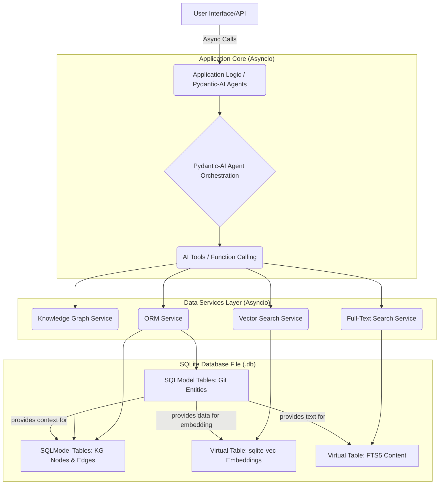

Absolutely! Here's a Markdown document outlining the design elements for your Git analysis tool, leveraging SQLite, Pydantic, asyncio, and focusing on an agentic RAG approach, with Pydantic-AI as your core AI functionality.

---

# Git Analysis Tool: Asynchronous Data & AI Architecture

## 1. Introduction

This document outlines the architectural design for a Git analysis tool, focusing on its core data storage, retrieval mechanisms, and AI augmentation capabilities. The primary goal is to establish a robust, asynchronous, and Pydantic-native foundation that supports sophisticated AI features, particularly agentic Retrieval-Augmented Generation (RAG).

## 2. Core Principles & Technology Choices

The design adheres to the following principles:

*   **SQLite-Centric:** Leverage SQLite as the primary, embeddable, and self-contained data store for all application data. This simplifies deployment, distribution, and local data management.
*   **Asynchronous Operations:** Utilize Python's `asyncio` ecosystem end-to-end to ensure non-blocking I/O and maintain responsiveness for UI and AI processing.
*   **Pydantic-Native:** Embrace Pydantic for data validation, serialization, and as the foundational element for database schema definition, ensuring strong typing and reduced boilerplate.
*   **Agentic RAG Enablement:** Implement a multi-modal retrieval system combining vector search and a knowledge graph to empower AI agents with deep contextual understanding of Git repositories.

### 2.1 Core Technologies

| Layer                  | Primary Tool       | Rationale                                                                                                                                                                                                                                                                                                                            |
| :--------------------- | :----------------- | :----------------------------------------------------------------------------------------------------------------------------------------------------------------------------------------------------------------------------------------------------------------------------------------------------------------------------------- |
| **Data Storage**       | SQLite             | Embeddable, transactional, single-file database. Ideal for local applications requiring robust data persistence without external server management.                                                                                                                                                                                      |
| **ORM & Schema**       | `SQLModel`         | Built by the creator of FastAPI and Pydantic, it provides seamless integration of Pydantic models with SQLAlchemy. This allows defining database schemas directly from Pydantic classes, reducing duplication and enhancing type safety for both database and application layers.                                                      |
| **Async Driver**       | `aiosqlite`        | The asyncio-compatible driver for SQLite, ensuring all database operations are non-blocking and integrate smoothly with the `asyncio` event loop.                                                                                                                                                                                        |
| **Vector Database**    | `sqlite-vec`       | A SQLite extension for efficient Approximate Nearest Neighbor (ANN) search on high-dimensional vectors. Enables local vector storage and similarity search directly within the SQLite database file, crucial for semantic search and RAG.                                                                                             |
| **Knowledge Graph**    | `NetworkX`         | A powerful Python library for graph creation, manipulation, and algorithm execution. Used for in-memory graph processing (e.g., shortest path, community detection) on data retrieved from SQLite.                                                                                                                                      |
| **Full-Text Search**   | SQLite `FTS5`      | SQLite's built-in full-text search engine. Essential for keyword-based search on code content, commit messages, and other textual data within the Git repository.                                                                                                                                                                         |
| **AI Core & Agents**   | `Pydantic-AI`      | Leverages Pydantic models for structured input/output with Large Language Models (LLMs). This framework will define the agentic capabilities, tool definitions, and orchestrate interactions with various data services for RAG.                                                                                                         |
| **Vector Embedding**   | (External Models)  | An external LLM or embedding model (e.g., OpenAI's `text-embedding-ada-002`, local Hugging Face models) will be used to generate embeddings for text chunks, commit messages, code, etc. These embeddings are then stored and indexed by `sqlite-vec`.                                                                                   |

## 3. Architectural Overview

The system is structured into distinct layers, ensuring separation of concerns and modularity, all operating asynchronously.

### 3.1 Key Components

#### 3.1.1 Application Logic / Pydantic-AI Agents

This layer orchestrates the application's functionality and acts as the brain for AI-driven features.

*   **Pydantic-AI Core:** Manages the definition of AI agents, their goals, and their ability to use defined tools. It leverages Pydantic models extensively for structured prompts, parsing LLM outputs, and ensuring data integrity throughout the AI pipeline.
*   **Agent Tools / Function Calling:** Agents will interact with the data services by calling specific, well-defined functions (tools). These tools are essentially wrappers around the underlying data service methods, presented in a format understandable by LLMs (e.g., JSON schema for function calling).

#### 3.1.2 Data Services Layer

This layer provides a high-level, asynchronous API for interacting with the SQLite database, abstracting away the low-level database operations.

*   **ORM Service (`SQLModel`):**
    *   **Purpose:** Manages the persistent storage and retrieval of all structured Git repository data (e.g., `Commit`, `File`, `Author`, `Issue`, `PullRequest` models) and the core knowledge graph structure (`KGNode`, `KGEdge`).
    *   **Implementation:** Utilizes `SQLModel` classes directly as database table definitions. Provides asynchronous CRUD operations.
    *   **Pydantic Synergy:** `SQLModel`'s direct use of Pydantic models ensures that data fetched from the database can be directly validated and used by Pydantic-AI agents, and vice versa.

*   **Vector Search Service (`sqlite-vec`):**
    *   **Purpose:** Stores and performs similarity searches on high-dimensional vector embeddings, crucial for semantic retrieval in RAG.
    *   **Implementation:** Manages a `sqlite-vec` virtual table. Insertion of embeddings involves writing to this virtual table (via raw SQL / `aiosqlite`) while metadata about the embedding (e.g., its source, associated Git entity ID) is stored in a related `SQLModel` table (`EmbeddingRecord`). Search operations involve querying the `sqlite-vec` table and joining results with `EmbeddingRecord` for context.
    *   **Pydantic Synergy:** `EmbeddingRecord` will be a `SQLModel` (Pydantic-based) class, ensuring structured metadata for each embedding. AI agents will receive Pydantic models containing search results.

*   **Knowledge Graph Service (`NetworkX`, `SQLModel`):**
    *   **Purpose:** Represents and queries the relationships between various Git entities (e.g., a commit fixes an issue, an author modifies a file, a code chunk is part of a function). Enhances reasoning and contextual retrieval for agents.
    *   **Implementation:** The graph structure (nodes and edges) is persistently stored in `SQLModel` tables (`KGNode`, `KGEdge`). For complex graph algorithms (e.g., path finding, community detection), relevant subgraphs are loaded asynchronously into `NetworkX` `DiGraph` objects in memory, processed, and results are returned.
    *   **Pydantic Synergy:** `KGNode` and `KGEdge` are `SQLModel` classes, ensuring structured representation of graph entities and their properties for agents.

*   **Full-Text Search Service (`FTS5`):**
    *   **Purpose:** Provides fast keyword-based search across textual content like commit messages, file contents, code comments, and issue descriptions.
    *   **Implementation:** Leverages SQLite's `FTS5` virtual tables. Operations (indexing and querying) are performed via raw SQL executed asynchronously using `aiosqlite`.
    *   **Pydantic Synergy:** Search results would typically be mapped back to Pydantic models (e.g., `CommitSearchResult`) that contain relevant textual snippets and metadata, making them consumable by agents.

#### 3.1.3 SQLite Database File

A single `.db` file serves as the unified persistent storage for all data.

*   **SQLModel Tables:** Standard relational tables defined and managed by `SQLModel` for structured Git data and the knowledge graph's nodes/edges.
*   **`sqlite-vec` Virtual Table:** A specialized virtual table for high-performance vector indexing and search.
*   **`FTS5` Virtual Table:** Another specialized virtual table for efficient full-text indexing and searching.

## 4. Agentic RAG Workflow

The integration of these components enables powerful agentic RAG:

1.  **User Query:** A user submits a complex query (e.g., "Summarize recent changes made by Alice related to performance issues in the authentication module, and find similar code patterns.").
2.  **Pydantic-AI Agent Deliberation:** An `Pydantic-AI` agent receives the query and, based on its defined tools and internal logic, breaks down the request into sub-tasks.
3.  **Tool Selection & Execution:**
    *   **FTS Tool:** Agent might first use the FTS Service to find "performance issues" in issue descriptions or commit messages.
    *   **Knowledge Graph Tool:** With identified issues/commits, the agent might use the KG Service to find related authors (Alice), changed files, or connected code components (authentication module). It might traverse the graph to find "similar code patterns" that are semantically linked.
    *   **Vector Search Tool:** If specific code snippets are retrieved from the KG or FTS, the agent might then use the Vector Search Service to find semantically similar code chunks within the repository using their embeddings.
    *   **ORM Tool:** At any point, the agent can use the ORM Service to retrieve full details of specific Git entities (e.g., full commit message, diff content) based on IDs found through other tools.
4.  **Context Assembly:** The retrieved, structured data from various services (code snippets, commit messages, related issues, author information) is assembled as rich context, often as Pydantic models.
5.  **LLM Augmentation:** The assembled context is fed into an LLM (via `Pydantic-AI`) along with the original query for synthesis, summarization, or detailed answer generation.
6.  **Response:** The LLM's structured output (parsed by Pydantic) is presented to the user.

## 5. Benefits

*   **Unified Data Storage:** A single `.db` file simplifies distribution and management.
*   **High Performance:** Asynchronous operations prevent blocking, ensuring a responsive application.
*   **Maintainability & Type Safety:** Pydantic and `SQLModel` provide a consistent, type-safe data layer, reducing bugs and simplifying development.
*   **Advanced AI Capabilities:** The combination of relational data, vector search, and a knowledge graph enables complex, intelligent querying and reasoning for AI agents.
*   **Local Execution:** The entire data stack can run locally without external dependencies, ideal for sensitive Git data.

This design provides a robust and modern foundation for a powerful Git analysis tool with sophisticated AI capabilities.
