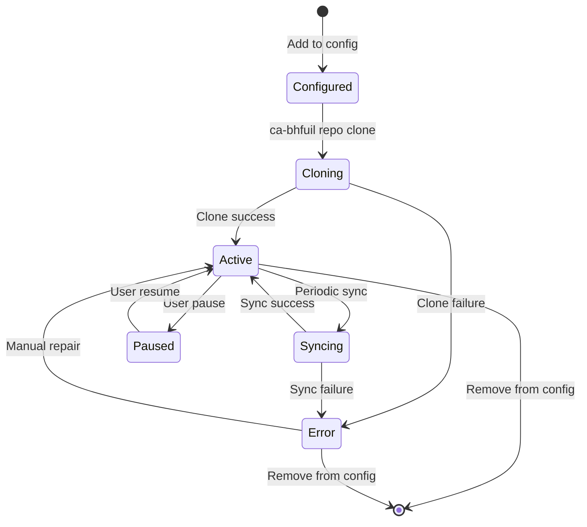

# Ca-Bhfuil Repository Management

> **Git repository operations, cloning, synchronization, and branch management**

## Overview

Ca-Bhfuil manages multiple git repositories locally for analysis, providing automated cloning, synchronization, and branch management capabilities. The system is designed for **performance** with large repositories, **reliability** through configuration-driven automation, and **efficiency** with incremental processing.

## Repository Management Philosophy

### Local Repository Strategy
- **Local Clones**: All repositories cloned locally for maximum performance
- **Bare Repositories**: Storage-optimized bare clones for analysis-only workloads
- **Incremental Sync**: Only fetch new commits and branches since last sync
- **Configurable Retention**: Automatic cleanup based on configured policies

### Configuration-Driven Operations
- **Declarative Management**: YAML configuration defines all repository sources
- **Branch Selection**: Pattern-based branch filtering for focused analysis
- **Sync Strategies**: Configurable sync intervals and strategies per repository
- **Authentication Handling**: Multiple authentication methods with secure storage

## Repository Lifecycle

### Repository States



### Repository Configuration

Each repository is defined with comprehensive configuration:

```yaml
repositories:
  - name: "linux-kernel"
    source:
      url: "git@github.com:torvalds/linux.git"
      type: "github"

    # Additional remotes for comprehensive analysis
    remotes:
      - name: "stable"
        url: "https://git.kernel.org/pub/scm/linux/kernel/git/stable/linux.git"
        fetch_refs: ["refs/heads/linux-*", "refs/tags/v*"]

    # Branch selection and filtering
    branches:
      patterns: ["master", "linux-*", "stable/*"]
      exclude_patterns: ["!linux-2.6.*"]
      max_branches: 50

    # Synchronization strategy
    sync:
      strategy: "fetch_all"  # fetch_all, fetch_recent, manual
      interval: "4h"
      prune_deleted: true

    # Storage and performance settings
    storage:
      type: "bare"
      max_size: "5GB"
      retention_days: 365

    # Authentication reference
    auth_key: "github-default"
```

## Core Components

### Repository Registry

**Purpose**: Central tracking of all managed repositories

```python
from dataclasses import dataclass
from datetime import datetime
from pathlib import Path
from typing import Optional, List

@dataclass
class RepositoryEntry:
    """Registry entry for managed repository"""
    url_path: str          # URL-based path identifier
    name: str              # User-friendly name
    source_url: str        # Primary remote URL
    repo_path: Path        # Path to git repository
    state_path: Path       # Path to metadata directory
    status: str            # active, paused, error, not_synced
    last_sync: Optional[datetime]
    last_analysis: Optional[datetime]
    config_hash: str       # Configuration change detection
    repo_size: int         # Git repository size in bytes
    commit_count: int      # Number of commits
    branch_count: int      # Number of branches
    created_at: datetime
    updated_at: datetime

class RepositoryRegistry:
    """Manages repository registry database"""

    def register_repository(self, config: RepositoryConfig) -> RepositoryEntry:
        """Register new repository in registry"""

    def get_repository(self, identifier: str) -> Optional[RepositoryEntry]:
        """Get repository by name or URL path"""

    def list_repositories(self, status_filter: Optional[str] = None) -> List[RepositoryEntry]:
        """List repositories with optional filtering"""

    def update_sync_status(self, url_path: str, status: str,
                          last_sync: datetime, stats: dict) -> None:
        """Update repository sync metadata"""
```

### Repository Cloner

**Purpose**: Handle initial repository cloning with progress tracking

```python
import pygit2
from pathlib import Path
from typing import Optional, Callable, Dict, Any

class CloneProgress:
    """Progress tracking for clone operations"""

    def __init__(self, callback: Optional[Callable] = None):
        self.callback = callback
        self.total_objects = 0
        self.received_objects = 0
        self.received_bytes = 0
        self.percent_complete = 0.0

    def update(self, stats) -> None:
        """Update progress from pygit2 stats"""
        self.total_objects = stats.total_objects
        self.received_objects = stats.received_objects  
        self.received_bytes = stats.received_bytes

        if self.total_objects > 0:
            self.percent_complete = (self.received_objects / self.total_objects) * 100

        if self.callback:
            self.callback(self)

class RepositoryCloner:
    """Handles repository cloning operations"""

    def __init__(self, cache_dir: Path, state_dir: Path):
        self.cache_dir = cache_dir
        self.state_dir = state_dir
        self.temp_dir = cache_dir / "temp" / "clone-staging"
        self.temp_dir.mkdir(parents=True, exist_ok=True)

    async def clone_repository(self,
                              config: RepositoryConfig,
                              progress_callback: Optional[Callable] = None) -> Path:
        """Clone repository with progress tracking and error handling"""

        # Prepare clone location
        repo_path = self._get_repo_path(config)
        if repo_path.exists():
            raise ValueError(f"Repository already exists: {repo_path}")

        # Setup authentication
        auth_callbacks = self._setup_authentication(config)

        # Setup progress tracking
        progress = CloneProgress(progress_callback)

        # Prepare clone options
        clone_options = {
            'bare': config.storage.type == "bare",
            'checkout_branch': None,  # Clone all branches
            'callbacks': pygit2.RemoteCallbacks(
                credentials=auth_callbacks.get('credentials'),
                progress=progress.update
            )
        }

        try:
            # Perform clone operation
            repo = pygit2.clone_repository(
                config.source_url,
                str(repo_path),
                **clone_options
            )

            # Setup additional remotes
            await self._setup_additional_remotes(repo, config.remotes)

            # Initial branch filtering
            self._filter_branches(repo, config.branches)

            return repo_path

        except Exception as e:
            # Cleanup on failure
            if repo_path.exists():
                shutil.rmtree(repo_path)
            raise CloneError(f"Failed to clone {config.source_url}: {e}")

    def _setup_authentication(self, config: RepositoryConfig) -> Dict[str, Any]:
        """Setup authentication callbacks for pygit2"""
        auth_config = self._get_auth_config(config.auth_key)

        if auth_config.type == "ssh_key":
            return {
                'credentials': pygit2.Keypair(
                    username="git",
                    pubkey=f"{auth_config.ssh_key_path}.pub",
                    privkey=auth_config.ssh_key_path,
                    passphrase=os.getenv(auth_config.ssh_key_passphrase_env)
                )
            }
        elif auth_config.type == "token":
            return {
                'credentials': pygit2.UserPass(
                    username=os.getenv(auth_config.username_env),
                    password=os.getenv(auth_config.token_env)
                )
            }
        else:
            return {}  # Use system git credential helper
```

### Repository Syncer

**Purpose**: Handle ongoing synchronization with remotes

```python
from datetime import datetime, timedelta
from typing import List, Dict, Any

class SyncResult:
    """Results from synchronization operation"""

    def __init__(self):
        self.success = False
        self.updated_refs: List[str] = []
        self.new_commits = 0
        self.deleted_refs: List[str] = []
        self.errors: List[str] = []
        self.duration: float = 0.0
        self.strategy_used: str = ""

class RepositorySyncer:
    """Handles repository synchronization with remotes"""

    def __init__(self):
        self.logger = logging.getLogger(__name__)

    async def sync_repository(self,
                             repo_path: Path,
                             config: RepositoryConfig) -> SyncResult:
        """Sync repository based on configuration strategy"""

        start_time = time.time()
        result = SyncResult()
        result.strategy_used = config.sync.strategy

        try:
            repo = pygit2.Repository(str(repo_path))

            # Execute sync strategy
            if config.sync.strategy == "fetch_all":
                await self._sync_fetch_all(repo, config, result)
            elif config.sync.strategy == "fetch_recent":
                await self._sync_fetch_recent(repo, config, result)
            elif config.sync.strategy == "manual":
                result.success = True  # No automatic sync
                return result
            else:
                raise ValueError(f"Unknown sync strategy: {config.sync.strategy}")

            # Filter branches after sync
            if result.success:
                self._filter_branches(repo, config.branches)

                # Prune deleted remote branches if configured
                if config.sync.prune_deleted:
                    deleted_refs = self._prune_deleted_branches(repo)
                    result.deleted_refs.extend(deleted_refs)

        except Exception as e:
            result.errors.append(str(e))
            self.logger.error(f"Sync failed for {repo_path}: {e}")

        result.duration = time.time() - start_time
        return result

    async def _sync_fetch_all(self,
                             repo: pygit2.Repository,
                             config: RepositoryConfig,
                             result: SyncResult) -> None:
        """Fetch all refs from all remotes"""

        for remote_name in repo.remotes:
            try:
                remote = repo.remotes[remote_name]

                # Setup authentication
                auth_callbacks = self._setup_auth_callbacks(config)

                # Fetch from remote
                remote.fetch(callbacks=auth_callbacks)

                # Track updated refs
                for ref in remote.fetch_refspecs:
                    result.updated_refs.append(f"{remote_name}:{ref}")

                result.success = True

            except Exception as e:
                result.errors.append(f"Remote {remote_name}: {e}")

    async def _sync_fetch_recent(self,
                                repo: pygit2.Repository,
                                config: RepositoryConfig,
                                result: SyncResult) -> None:
        """Fetch only recent commits based on configuration"""

        # Calculate cutoff date
        cutoff_days = config.sync.recent_days or 30
        cutoff_date = datetime.now() - timedelta(days=cutoff_days)

        # Implementation depends on git provider capabilities
        # Some providers support date-based fetching

        # For now, fall back to fetch_all strategy
        await self._sync_fetch_all(repo, config, result)

    def _filter_branches(self,
                        repo: pygit2.Repository,
                        branch_config: BranchConfig) -> List[str]:
        """Filter branches based on configuration patterns"""

        import fnmatch

        all_branches = [ref.shorthand for ref in repo.branches.remote]
        filtered_branches = []

        # Apply include patterns
        for pattern in branch_config.patterns:
            matching = fnmatch.filter(all_branches, pattern)
            filtered_branches.extend(matching)

        # Remove duplicates
        filtered_branches = list(set(filtered_branches))

        # Apply exclude patterns
        for exclude_pattern in branch_config.exclude_patterns:
            if exclude_pattern.startswith('!'):
                pattern = exclude_pattern[1:]
                excluded = fnmatch.filter(filtered_branches, pattern)
                for branch in excluded:
                    if branch in filtered_branches:
                        filtered_branches.remove(branch)

        # Apply max_branches limit
        if len(filtered_branches) > branch_config.max_branches:
            # Sort by last commit date and take most recent
            branch_dates = []
            for branch_name in filtered_branches:
                try:
                    branch = repo.branches.remote[branch_name]
                    commit = repo[branch.target]
                    branch_dates.append((branch_name, commit.commit_time))
                except:
                    branch_dates.append((branch_name, 0))

            # Sort by commit time (newest first)
            branch_dates.sort(key=lambda x: x[1], reverse=True)
            filtered_branches = [name for name, _ in branch_dates[:branch_config.max_branches]]

        return filtered_branches
```

### Repository Manager

**Purpose**: High-level repository management operations

```python
class RepositoryManager:
    """High-level repository management orchestration"""

    def __init__(self,
                 config_manager: ConfigManager,
                 registry: RepositoryRegistry,
                 cloner: RepositoryCloner,
                 syncer: RepositorySyncer):
        self.config_manager = config_manager
        self.registry = registry
        self.cloner = cloner
        self.syncer = syncer

    async def initialize_repositories(self) -> Dict[str, Any]:
        """Initialize all repositories from configuration"""
        config = self.config_manager.load_config()
        results = {
            "cloned": [],
            "synced": [],
            "errors": []
        }

        for repo_config in config.repositories:
            try:
                # Check if repository already exists
                existing = self.registry.get_repository(repo_config.name)

                if not existing:
                    # Clone new repository
                    repo_path = await self.cloner.clone_repository(repo_config)

                    # Register in registry
                    entry = self.registry.register_repository(repo_config)
                    results["cloned"].append(entry.name)
                else:
                    # Sync existing repository
                    sync_result = await self.syncer.sync_repository(
                        existing.repo_path,
                        repo_config
                    )

                    if sync_result.success:
                        results["synced"].append(existing.name)
                    else:
                        results["errors"].append({
                            "repo": existing.name,
                            "errors": sync_result.errors
                        })

            except Exception as e:
                results["errors"].append({
                    "repo": repo_config.name,
                    "error": str(e)
                })

        return results

    async def sync_repository(self, identifier: str, force: bool = False) -> Dict[str, Any]:
        """Sync specific repository by name or URL"""
        entry = self.registry.get_repository(identifier)
        if not entry:
            raise ValueError(f"Repository not found: {identifier}")

        config = self.config_manager.get_repository_config(entry.name)
        if not config:
            raise ValueError(f"Configuration not found for: {identifier}")

        # Check if sync is needed (unless forced)
        if not force and self._is_sync_recent(entry, config):
            return {"status": "skipped", "reason": "recent_sync"}

        # Perform sync
        sync_result = await self.syncer.sync_repository(entry.repo_path, config)

        # Update registry
        if sync_result.success:
            self.registry.update_sync_status(
                entry.url_path,
                "active",
                datetime.now(),
                {
                    "new_commits": sync_result.new_commits,
                    "updated_refs": len(sync_result.updated_refs),
                    "duration": sync_result.duration
                }
            )

        return {
            "status": "success" if sync_result.success else "error",
            "result": sync_result
        }

    def get_repository_status(self, identifier: str) -> Dict[str, Any]:
        """Get detailed status of repository"""
        entry = self.registry.get_repository(identifier)
        if not entry:
            raise ValueError(f"Repository not found: {identifier}")

        # Get git repository info
        repo = pygit2.Repository(str(entry.repo_path))

        return {
            "name": entry.name,
            "status": entry.status,
            "source_url": entry.source_url,
            "repo_path": str(entry.repo_path),
            "state_path": str(entry.state_path),
            "last_sync": entry.last_sync,
            "last_analysis": entry.last_analysis,
            "repo_size": entry.repo_size,
            "commit_count": entry.commit_count,
            "branch_count": len(list(repo.branches.remote)),
            "remotes": [remote.name for remote in repo.remotes],
            "head": repo.head.shorthand if not repo.head_is_unborn else None
        }
```

## CLI Commands

### Repository Management Commands

```bash
# Repository lifecycle
ca-bhfuil repo add <url> [--name=<name>]     # Add new repository
ca-bhfuil repo clone <name|url>              # Clone specific repository  
ca-bhfuil repo clone --all                   # Clone all configured repositories
ca-bhfuil repo remove <name|url>             # Remove repository
ca-bhfuil repo list [--status=<filter>]      # List repositories

# Synchronization
ca-bhfuil repo sync <name|url>               # Sync specific repository
ca-bhfuil repo sync --all                    # Sync all repositories
ca-bhfuil repo sync <name> --force           # Force sync regardless of interval

# Information and status
ca-bhfuil repo status [<name|url>]           # Show repository status
ca-bhfuil repo info <name|url>               # Detailed repository information
ca-bhfuil repo paths <name|url>              # Show file system paths

# Maintenance
ca-bhfuil repo cleanup [--dry-run]           # Clean up storage
ca-bhfuil repo validate                      # Validate repository integrity
```

### Command Examples

```bash
# Add and clone a new repository
ca-bhfuil repo add git@github.com:torvalds/linux.git --name linux-kernel
ca-bhfuil repo clone linux-kernel

# Sync all repositories with progress
ca-bhfuil repo sync --all --verbose

# Get detailed status
ca-bhfuil repo status linux-kernel
ca-bhfuil repo info linux-kernel --format json

# Maintenance operations
ca-bhfuil repo cleanup --dry-run
ca-bhfuil repo validate --all
```

## Error Handling and Recovery

### Common Error Scenarios

1. **Clone Failures**
   - Network connectivity issues
   - Authentication failures
   - Disk space limitations
   - Invalid repository URLs

2. **Sync Failures**
   - Remote repository changes (force pushes)
   - Authentication token expiration
   - Network timeouts
   - Conflicting local modifications

3. **Configuration Errors**
   - Invalid branch patterns
   - Missing authentication keys
   - Incorrect sync intervals
   - Storage limit exceeded

### Recovery Strategies

```python
class RepositoryRecovery:
    """Handles repository error recovery"""

    def diagnose_repository(self, repo_path: Path) -> Dict[str, Any]:
        """Diagnose repository issues"""
        issues = []

        try:
            repo = pygit2.Repository(str(repo_path))

            # Check repository health
            if repo.head_is_unborn:
                issues.append("empty_repository")

            # Check for corrupted objects
            # Implementation depends on specific requirements

        except Exception as e:
            issues.append(f"repository_error: {e}")

        return {"issues": issues}

    def repair_repository(self, repo_path: Path) -> bool:
        """Attempt to repair repository issues"""
        # Implementation of repair strategies
        pass

    def reset_repository(self, repo_path: Path, config: RepositoryConfig) -> bool:
        """Reset repository to clean state (re-clone)"""
        # Remove existing repository
        if repo_path.exists():
            shutil.rmtree(repo_path)

        # Re-clone from source
        cloner = RepositoryCloner(repo_path.parent, repo_path.parent / "state")
        cloner.clone_repository(config)

        return True
```

## Performance Optimization

### Sync Optimization Strategies

1. **Incremental Fetching**: Only fetch new commits since last sync
2. **Selective Branch Fetching**: Only fetch configured branch patterns
3. **Parallel Operations**: Sync multiple repositories concurrently
4. **Delta Compression**: Efficient git pack file handling
5. **Smart Scheduling**: Avoid unnecessary syncs with interval checking

### Monitoring and Metrics

```python
class RepositoryMetrics:
    """Repository performance metrics collection"""

    def record_sync_metrics(self, repo_name: str, sync_result: SyncResult) -> None:
        """Record sync performance metrics"""
        metrics = {
            "repo_name": repo_name,
            "duration": sync_result.duration,
            "new_commits": sync_result.new_commits,
            "updated_refs": len(sync_result.updated_refs),
            "success": sync_result.success,
            "timestamp": datetime.now()
        }

        # Store metrics for analysis
        self._store_metrics(metrics)

    def get_sync_performance(self, repo_name: str) -> Dict[str, Any]:
        """Get sync performance statistics"""
        # Return metrics analysis
        pass
```

## Cross-References

- **Storage implementation**: See [data-storage-design.md](data-storage-design.md)
- **System architecture**: See [architecture-overview.md](architecture-overview.md)
- **Technology choices**: See [technology-decisions.md](technology-decisions.md)
- **CLI patterns**: See [cli-design-patterns.md](cli-design-patterns.md)
- **Development workflow**: See [development-workflow.md](development-workflow.md)

---

This repository management system provides robust, efficient, and scalable git repository operations while maintaining the local-first philosophy and high-performance requirements of ca-bhfuil.
