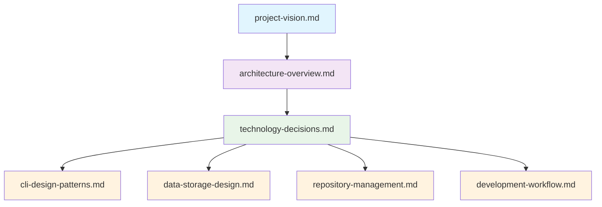

# Ca-Bhfuil Design Documentation

> **Comprehensive design documentation for the ca-bhfuil project**

## Document Structure

This directory contains focused, single-topic design documents that eliminate duplication and provide clear separation of concerns.

### Core Design Documents

| Document | Purpose | Audience |
|----------|---------|----------|
| **[project-vision.md](project-vision.md)** | Product vision, user goals, and success metrics | Product managers, stakeholders |
| **[architecture-overview.md](architecture-overview.md)** | High-level system architecture and component design | System architects, lead developers |
| **[technology-decisions.md](technology-decisions.md)** | Technology choices and rationale | Technical leads, contributors |

### Implementation Design Documents

| Document | Purpose | Audience |
|----------|---------|----------|
| **[cli-design-patterns.md](cli-design-patterns.md)** | CLI design principles and conventions | Frontend developers, UX designers |
| **[data-storage-design.md](data-storage-design.md)** | Storage architecture and data management | Backend developers, data engineers |
| **[repository-management.md](repository-management.md)** | Git operations and repository management | Git specialists, DevOps engineers |
| **[development-workflow.md](development-workflow.md)** | CI/CD pipeline and development process | DevOps engineers, contributors |

## Document Relationships

## Reading Guide

### For New Contributors
1. Start with **[project-vision.md](project-vision.md)** to understand the product goals
2. Read **[architecture-overview.md](architecture-overview.md)** for system understanding
3. Review **[technology-decisions.md](technology-decisions.md)** for context on tool choices
4. Focus on relevant implementation documents based on your contribution area

### For System Architects
1. **[architecture-overview.md](architecture-overview.md)** - Complete system design
2. **[technology-decisions.md](technology-decisions.md)** - Technology rationale
3. **[data-storage-design.md](data-storage-design.md)** - Storage architecture
4. **[repository-management.md](repository-management.md)** - Git operations design

### For Developers
1. **[technology-decisions.md](technology-decisions.md)** - Understanding tool choices
2. **[development-workflow.md](development-workflow.md)** - Development and CI/CD process
3. Implementation documents relevant to your work area
4. **[cli-design-patterns.md](cli-design-patterns.md)** - For UI/CLI development

### For DevOps Engineers
1. **[development-workflow.md](development-workflow.md)** - Complete CI/CD pipeline
2. **[technology-decisions.md](technology-decisions.md)** - Infrastructure technology choices
3. **[data-storage-design.md](data-storage-design.md)** - Storage and persistence requirements

## Design Principles

### Single Responsibility
Each document covers one aspect of the system thoroughly without duplication.

### Clear Scope
Every document has explicit boundaries defining what it covers and what it doesn't.

### Cross-References
Related information is linked rather than duplicated across documents.

### Focused Audience
Each document is written for specific roles and use cases.

## Historical Documents

Previous design documents have been archived in the **[archive/](archive/)** directory with a comprehensive migration guide. These documents contained significant duplication and overlapping concerns that have been resolved in the current structure.

## Maintenance

### Document Updates
- Update documents individually when changes affect their specific scope
- Use cross-references to avoid duplication
- Maintain consistency in terminology across documents

### Review Process
- Monthly review of document accuracy and completeness
- Quarterly review of document structure and relationships
- Update cross-references when documents are restructured

## Quick Reference

### Common Questions

**"How does the system work?"** → [architecture-overview.md](architecture-overview.md)  
**"Why did we choose this technology?"** → [technology-decisions.md](technology-decisions.md)  
**"How do I contribute?"** → [development-workflow.md](development-workflow.md)  
**"How should CLI commands work?"** → [cli-design-patterns.md](cli-design-patterns.md)  
**"How is data stored?"** → [data-storage-design.md](data-storage-design.md)  
**"How do git operations work?"** → [repository-management.md](repository-management.md)  
**"What problem are we solving?"** → [project-vision.md](project-vision.md)

---

This design documentation provides comprehensive guidance for understanding, contributing to, and maintaining the ca-bhfuil project.
