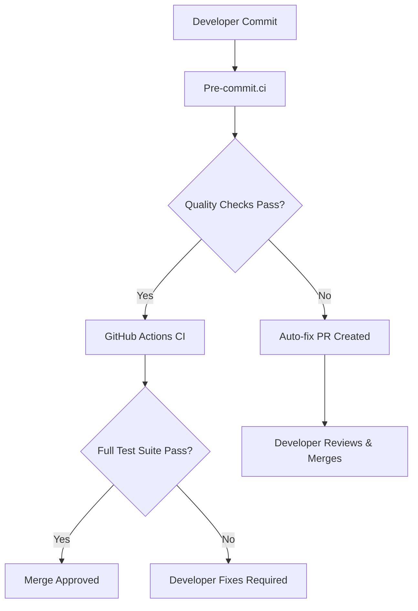

# Ca-Bhfuil CI/CD Design Document

> **Continuous Integration and Deployment strategy for the Ca-Bhfuil project**
>
> **Version**: 1.0 | **Last Updated**: 2025-06-24 | **Status**: Implementation Ready

## Executive Summary

Ca-Bhfuil employs a **two-tier CI strategy** combining pre-commit.ci for fast feedback and GitHub Actions for comprehensive testing. The current implementation targets **Ubuntu 24.04 LTS** with **Python 3.12**, emphasizing a **ruff-first philosophy** with a clear expansion roadmap.

### Key Principles
- **Fast Feedback**: < 2 minutes for essential quality checks
- **Comprehensive Testing**: < 10 minutes for full CI pipeline
- **Ruff-Centric**: Leverage ruff's expanding capabilities over time
- **Developer-Friendly**: Minimal friction, clear error messages
- **Scalable Design**: Ready for future platform and tool expansion

## Architecture Overview



### Tier 1: Pre-commit.ci (Fast Feedback)
**Purpose**: Immediate code quality enforcement  
**Target**: < 2 minutes execution time  
**Strategy**: Auto-fix where possible, fail fast on critical issues

### Tier 2: GitHub Actions (Comprehensive Testing)
**Purpose**: Full validation and deployment pipeline  
**Target**: < 10 minutes execution time  
**Strategy**: Complete test matrix, security scanning, build validation

## Current Implementation (Phase 1)

### Platform Specification
- **Operating System**: Ubuntu 24.04 LTS
- **Python Version**: 3.12.x (latest stable)
- **Package Manager**: uv (for speed and reliability)
- **Test Framework**: pytest with comprehensive coverage

### Core Tool Stack
| Tool | Purpose | Version | Auto-fix |
|------|---------|---------|----------|
| **ruff** | Formatting & Linting | Latest | ✅ |
| **mypy** | Type Checking | 1.8+ | ❌ |
| **pytest** | Unit & Integration Testing | 7.4+ | ❌ |

### Quality Gates
All checks must pass for merge approval:
1. **Code Formatting**: ruff format compliance
2. **Linting**: ruff check with project rules
3. **Type Safety**: mypy strict mode (src only)
5. **Tests**: 96+ tests passing with coverage targets
6. **File Validation**: YAML/JSON/TOML syntax checking

## Pre-commit.ci Configuration

### Hook Execution Strategy
```yaml
# Execution order optimized for performance
1. File format validation (fast fail)
2. Ruff formatting (auto-fix)
3. Ruff linting (auto-fix where possible)
4. Type checking (mypy - no auto-fix)
```

### Auto-fix Capabilities
- **Formatting**: Code style, import sorting, whitespace
- **Basic Linting**: Unused imports, simple style violations
- **File Issues**: Line endings, trailing whitespace, EOF newlines

### Performance Targets
- **Individual Hook**: < 30 seconds
- **Total Pipeline**: < 2 minutes
- **Auto-fix Rate**: > 80% of formatting/style issues

### Update Strategy
- **Automatic Updates**: Weekly via pre-commit.ci
- **Version Pinning**: Quarterly review and manual updates for stability
- **Emergency Updates**: Security patches applied immediately

## GitHub Actions Workflows

### Main CI Pipeline (`.github/workflows/ci.yml`)

```yaml
name: Continuous Integration
on: [push, pull_request]
```

**Execution Matrix**:
- **OS**: Ubuntu 24.04 (single platform for Phase 1)
- **Python**: 3.12 (single version for Phase 1)
- **Dependencies**: Lock file validation + fresh installs

**Pipeline Steps**:
1. **Environment Setup** (2 min)
   - Checkout code
   - Setup Python 3.12
   - Install uv package manager
   - Cache dependencies

2. **Code Quality** (2 min)
   - ruff check (formatting + linting)
   - mypy type checking (strict mode)

3. **Testing** (4 min)
   - Unit tests with coverage
   - Integration tests (network-optional)
   - Performance baseline validation

4. **Build Validation** (2 min)
   - Package building (wheel + sdist)
   - Installation testing
   - CLI functionality validation

**Failure Handling**:
- **Fast Fail**: Stop on first critical failure
- **Detailed Reporting**: Clear error messages with fix suggestions
- **Artifact Collection**: Logs and coverage reports always available

### Dependency Management (`.github/workflows/deps.yml`)

**Schedule**: Weekly (Monday 6 AM UTC)  
**Purpose**: Automated dependency updates and security monitoring

**Process**:
1. **Dependency Updates**: uv lock update
2. **Security Scanning**: Check for known vulnerabilities  
3. **Compatibility Testing**: Run full test suite
4. **PR Creation**: Automated PRs for successful updates

### Release Pipeline (`.github/workflows/release.yml`)

**Trigger**: Version tags (`v*.*.*`)  
**Purpose**: Automated package publishing

**Process**:
1. **Validation**: Full CI pipeline must pass
2. **Building**: Create wheel and source distributions
3. **Testing**: Install and test built packages
4. **Publishing**: Upload to PyPI (with approval gate)

## Quality Standards

### Code Coverage
- **Target**: 90% overall coverage
- **Minimum**: 85% for new code
- **Reporting**: codecov.io integration
- **Enforcement**: Coverage regression blocks PRs

### Performance Benchmarks
- **CLI Response Time**: < 100ms for basic commands
- **Git Operations**: Baseline measurements for regression detection
- **CI Execution**: Track and optimize pipeline performance

### Security Standards
- **Dependency Scanning**: Daily vulnerability checks
- **Secret Detection**: Pre-commit hooks prevent credential leaks
- **Supply Chain**: Verified dependencies and lock file validation

### Documentation Quality
- **Code Documentation**: All public APIs documented
- **Architecture**: Design documents maintained and current
- **CI Documentation**: This document kept up-to-date
- **Examples**: Working examples for all major features

## Ruff Evolution Roadmap

### Current State (Phase 1)
```yaml
# Active ruff capabilities
formatting: ruff format
basic_linting: ruff check
import_sorting: Built into ruff
```

### Phase 2: Enhanced Linting (Q2 2025)
- **Replace isort**: Fully migrate to ruff's import sorting
- **Expand Rules**: Add complexity, naming, and docstring rules
- **Custom Rules**: Project-specific patterns and conventions
- **Performance**: Optimize rule selection for speed

### Phase 3: Advanced Analysis (Q3 2025)
- **Security Rules**: Integrate security-focused linting rules
- **Type Checking**: Explore ruff's type checking capabilities
- **Documentation**: Lint docstring quality and completeness
- **Testing**: Lint test organization and patterns

### Phase 4: Full Integration (Q4 2025)
- **Tool Consolidation**: Replace redundant tools where ruff excels
- **Custom Plugins**: Develop ca-bhfuil specific rules
- **CI Optimization**: Single tool for multiple quality concerns
- **Developer Tooling**: Enhanced local development experience

## Future Expansion Plans

### Platform Support (Future Phases)

**Windows Support** (Conditional):
- **Trigger**: User demand or contributor availability
- **Requirements**: Windows-specific testing, path handling validation
- **Implementation**: Add Windows to CI matrix, test Windows-specific features

**macOS Support** (Conditional):
- **Trigger**: macOS-specific features or contributor requests
- **Requirements**: macOS runner availability, platform-specific testing
- **Implementation**: Add macOS to CI matrix, validate Unix-like behavior

### Python Version Strategy

**Python 3.13+ Adoption**:
- **Timeline**: 6 months after stable release
- **Process**: Add to CI matrix, test compatibility, update dependencies
- **Migration**: Gradual adoption with backwards compatibility

**Version Lifecycle**:
- **Support Window**: 2 latest stable versions
- **Deprecation**: 6-month notice before dropping support
- **Emergency Support**: Critical security fixes only

## Developer Workflow

### Local Development Setup
```bash
# Required setup for all contributors
git clone <repository>
cd ca-bhfuil
uv venv
uv pip install -e ".[dev]"
pre-commit install
pre-commit install --hook-type commit-msg
```

### Pre-commit Integration
- **Automatic**: Hooks run on every commit
- **Manual**: `pre-commit run --all-files` for full check
- **Bypass**: `git commit --no-verify` (emergency only)

### Pull Request Process
1. **Local Testing**: Run `uv run pytest` before pushing
2. **Pre-commit.ci**: Automatic quality checks on push
3. **GitHub Actions**: Full CI pipeline on PR creation
4. **Review Process**: Code review after all checks pass
5. **Merge**: Squash and merge with conventional commit message

### Common Issue Resolution

**ruff Formatting Conflicts**:
```bash
# Fix formatting issues locally
uv run ruff format .
git add -A && git commit -m "style: apply ruff formatting"
```

**mypy Type Errors**:
```bash
# Check types locally
uv run mypy src/
# Fix issues and commit changes
```

**Test Failures**:
```bash
# Run specific failing tests
uv run pytest tests/path/to/test.py::TestClass::test_method -v
# Debug and fix, then verify full suite
uv run pytest
```

## Maintenance and Monitoring

### Update Schedule
- **Weekly**: Pre-commit hook updates (automatic)
- **Monthly**: Dependency security review
- **Quarterly**: Tool version evaluation and updates
- **Annually**: CI architecture review and optimization

### Performance Monitoring
- **CI Execution Time**: Track trends and optimize slow steps
- **Pre-commit Performance**: Monitor hook execution times
- **Resource Usage**: GitHub Actions minutes and storage
- **Developer Experience**: Survey and feedback collection

### Incident Response

**CI Failure Protocol**:
1. **Assessment**: Determine if failure blocks critical work
2. **Immediate Fix**: Apply hotfix if possible
3. **Temporary Bypass**: Use bypass procedures if necessary
4. **Root Cause**: Investigate and document failure cause
5. **Prevention**: Update processes to prevent recurrence

**Emergency Bypass Procedures**:
- **Pre-commit**: `git commit --no-verify` (requires justification)
- **CI Bypass**: Admin override (requires team approval)
- **Hotfix Process**: Direct merge to main (requires post-review)

## Cost and Resource Management

### GitHub Actions Budget
- **Monthly Limit**: Monitor usage and optimize for efficiency
- **Cost Centers**: Track usage by workflow type
- **Optimization**: Regularly review and optimize slow steps

### Resource Efficiency
- **Caching Strategy**: Aggressive caching for dependencies and build artifacts
- **Parallel Execution**: Optimize job parallelization
- **Resource Allocation**: Right-size runners for workload requirements

## Success Metrics

### Performance Targets
- **Pre-commit.ci**: < 2 minutes execution time
- **GitHub Actions**: < 10 minutes full pipeline
- **Developer Productivity**: < 5 minutes from push to feedback

### Quality Metrics
- **Test Success Rate**: > 98% on main branch
- **Auto-fix Rate**: > 80% of style/formatting issues
- **Security Issues**: Zero high-severity vulnerabilities
- **Coverage Regression**: < 1% decrease tolerance

### Developer Experience
- **CI Reliability**: > 99% uptime and consistent results
- **Clear Feedback**: Actionable error messages and fix suggestions
- **Documentation**: Up-to-date and comprehensive CI guidance

---

## Conclusion

This CI design provides a solid foundation for ca-bhfuil's development process, emphasizing speed, reliability, and developer experience. The phased approach allows for steady improvement while maintaining stability and clear upgrade paths.

The ruff-centric strategy positions the project to benefit from the rapidly evolving Python tooling ecosystem while maintaining compatibility and performance. Future expansions are planned and documented, ensuring smooth evolution as project needs grow.

**Next Steps**: Implement Phase 1 with Ubuntu 24.04 + Python 3.12, validate performance targets, and prepare for Phase 2 ruff enhancements.
