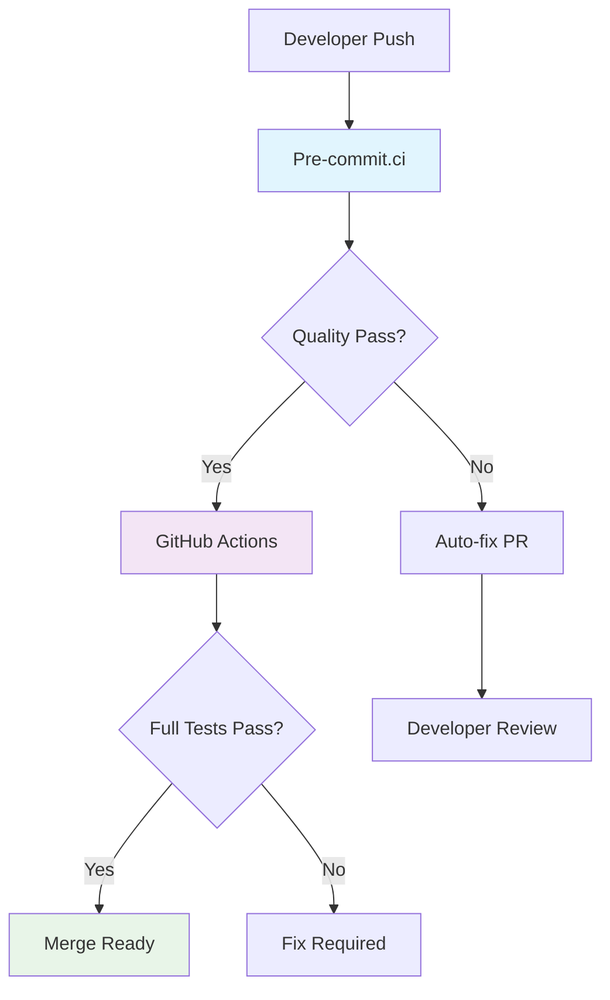

# Ca-Bhfuil Development Workflow

> **Development process, CI/CD pipeline, and deployment strategy**

## Overview

Ca-Bhfuil employs a **streamlined development workflow** optimized for single-developer productivity with AI assistance. The process emphasizes fast feedback, comprehensive automation, and reliable deployment while maintaining high code quality standards.

## Development Philosophy

### Core Principles
- **Fast Feedback**: Sub-2-minute quality checks for immediate developer feedback
- **Automation First**: Minimize manual processes through comprehensive automation
- **Quality Gates**: Multiple validation layers prevent issues from reaching users
- **Reproducible Builds**: Consistent results across development and production environments
- **Security by Default**: Built-in security scanning and signing processes

### Workflow Goals
- **Developer Productivity**: Minimize friction in daily development tasks
- **Code Quality**: Consistent, maintainable, and well-tested codebase
- **Deployment Reliability**: Confident releases with automated validation
- **Security Assurance**: Comprehensive security scanning and provenance tracking

## Development Environment

### Local Development Setup

```bash
# Prerequisites: Python 3.12+, git, uv package manager

# Repository setup
git clone https://github.com/SeanMooney/ca-bhfuil.git
cd ca-bhfuil

# Environment setup with uv
uv venv
uv pip install -e ".[dev]"

# Development tooling setup
pre-commit install
pre-commit install --hook-type commit-msg

# Verify installation
uv run ca-bhfuil --help
uv run pytest
uv run ruff check
uv run mypy src/
```

### Development Tools Stack

| Tool | Purpose | Configuration |
|------|---------|---------------|
| **UV** | Package management and virtual environments | `pyproject.toml` |
| **Ruff** | Code formatting and linting | `pyproject.toml` |
| **mypy** | Static type checking | `pyproject.toml` |
| **pytest** | Testing framework | `pyproject.toml` |
| **pre-commit** | Git hook automation | `.pre-commit-config.yaml` |

### Code Quality Standards

**Ruff Configuration**:
- **Formatting**: Automatic code style enforcement
- **Linting**: Comprehensive rule set covering common Python issues
- **Import Sorting**: Consistent import organization
- **Performance**: Fast execution for immediate feedback

**Type Safety**:
- **mypy Strict Mode**: Maximum type checking coverage
- **Type Hints Required**: All public APIs must have type annotations
- **Pydantic Integration**: Runtime type validation for data models

**Testing Requirements**:
- **Coverage Target**: 90% overall, 85% minimum for new code
- **Test Types**: Unit, integration, and performance tests
- **Fixtures**: Reusable test data and mock objects

## CI/CD Pipeline Architecture

### Two-Tier CI Strategy



### Tier 1: Pre-commit.ci (Fast Feedback)

**Purpose**: Immediate code quality enforcement  
**Target**: < 2 minutes execution time  
**Strategy**: Auto-fix where possible, fail fast on critical issues

**Hook Execution Order**:
1. **File Validation**: YAML, JSON, TOML syntax checking (fail fast)
2. **Ruff Format**: Automatic code formatting (auto-fix)
3. **Ruff Check**: Linting with auto-fix where possible
4. **mypy**: Type checking (no auto-fix, clear error messages)

**Auto-fix Capabilities**:
- Code formatting and style
- Import sorting and organization
- Simple linting violations
- File formatting (line endings, trailing whitespace)

### Tier 2: GitHub Actions (Comprehensive Validation)

**Purpose**: Full validation and deployment pipeline  
**Target**: < 10 minutes total execution time  
**Platform**: Ubuntu 24.04 LTS with Python 3.12

#### Main CI Pipeline (`.github/workflows/ci.yml`)

```yaml
name: Continuous Integration
on: [push, pull_request]

env:
  PYTHON_VERSION: "3.12"
  UV_CACHE_DIR: /tmp/.uv-cache

jobs:
  quality-checks:
    runs-on: ubuntu-24.04
    steps:
      - uses: actions/checkout@v4

      - name: Set up Python
        uses: actions/setup-python@v5
        with:
          python-version: ${{ env.PYTHON_VERSION }}

      - name: Install UV
        run: pip install uv

      - name: Cache dependencies
        uses: actions/cache@v4
        with:
          path: ${{ env.UV_CACHE_DIR }}
          key: uv-${{ runner.os }}-${{ hashFiles('uv.lock') }}

      - name: Install dependencies
        run: uv pip install -e ".[dev]"

      - name: Code quality checks
        run: |
          uv run ruff check
          uv run ruff format --check
          uv run mypy src/

      - name: Run tests
        run: |
          uv run pytest --cov=ca_bhfuil --cov-report=xml

      - name: Upload coverage
        uses: codecov/codecov-action@v4
        with:
          file: ./coverage.xml

  build-package:
    runs-on: ubuntu-24.04
    needs: quality-checks
    steps:
      - uses: actions/checkout@v4

      - name: Set up Python  
        uses: actions/setup-python@v5
        with:
          python-version: ${{ env.PYTHON_VERSION }}

      - name: Install UV
        run: pip install uv

      - name: Build package
        run: uv build

      - name: Verify installation
        run: |
          uv pip install dist/*.whl
          ca-bhfuil --help
          ca-bhfuil --version

      - name: Upload artifacts
        uses: actions/upload-artifact@v4
        with:
          name: python-packages
          path: dist/
```

### Container Build and Deployment

#### Multi-Stage Container Strategy

**Builder Stage (UV-based)**:
```dockerfile
FROM ghcr.io/astral-sh/uv:python3.12-alpine as builder

# Install build dependencies
RUN apk add --no-cache gcc musl-dev libgit2-dev

# Copy source and build
COPY . /app
WORKDIR /app
RUN uv build --wheel

# Install in virtual environment
RUN uv venv /app/venv
RUN uv pip install --target /app/venv dist/*.whl
```

**Runtime Stage (Alpine-based)**:
```dockerfile
FROM python:3.12-alpine as runtime

# Install runtime dependencies only
RUN apk add --no-cache libgit2 git

# Create non-root user
RUN adduser -D -s /bin/sh nonroot

# Copy virtual environment from builder
COPY --from=builder /app/venv /app/venv

# Set up runtime environment  
ENV PATH="/app/venv/bin:$PATH"
USER nonroot

ENTRYPOINT ["ca-bhfuil"]
```

#### Container Build Workflow

```yaml
name: Build and Release
on:
  push:
    branches: [main]    # Build and test only
    tags: ['v*']        # Build, sign, and publish

env:
  REGISTRY: ghcr.io
  IMAGE_NAME: ${{ github.repository }}

jobs:
  build-container:
    runs-on: ubuntu-latest
    permissions:
      contents: read
      packages: write
      id-token: write  # For OIDC signing

    steps:
      - uses: actions/checkout@v4

      - name: Set up Docker Buildx
        uses: docker/setup-buildx-action@v3

      - name: Login to registry
        if: startsWith(github.ref, 'refs/tags/')
        uses: docker/login-action@v3
        with:
          registry: ${{ env.REGISTRY }}
          username: ${{ github.actor }}
          password: ${{ secrets.GITHUB_TOKEN }}

      - name: Extract metadata
        id: meta
        uses: docker/metadata-action@v5
        with:
          images: ${{ env.REGISTRY }}/${{ env.IMAGE_NAME }}
          tags: |
            type=ref,event=branch
            type=semver,pattern={{version}}
            type=semver,pattern={{major}}.{{minor}}

      - name: Build and push
        uses: docker/build-push-action@v5
        with:
          context: .
          platforms: linux/amd64,linux/arm64
          push: ${{ startsWith(github.ref, 'refs/tags/') }}
          tags: ${{ steps.meta.outputs.tags }}
          labels: ${{ steps.meta.outputs.labels }}
          cache-from: type=gha
          cache-to: type=gha,mode=max

      # Security: Sign containers on release
      - name: Install Cosign
        if: startsWith(github.ref, 'refs/tags/')
        uses: sigstore/cosign-installer@v3

      - name: Sign container
        if: startsWith(github.ref, 'refs/tags/')
        run: |
          cosign sign --yes ${{ env.REGISTRY }}/${{ env.IMAGE_NAME }}:${{ steps.meta.outputs.version }}
```

## Security and Signing

### Container Security

**SBOM Generation**:
```yaml
- name: Generate SBOM
  if: startsWith(github.ref, 'refs/tags/')
  uses: anchore/sbom-action@v0
  with:
    image: ${{ env.REGISTRY }}/${{ env.IMAGE_NAME }}:${{ steps.meta.outputs.version }}
    format: spdx-json
    output-file: sbom.spdx.json

- name: Attest SBOM
  if: startsWith(github.ref, 'refs/tags/')
  run: |
    cosign attest --yes --predicate sbom.spdx.json \
      ${{ env.REGISTRY }}/${{ env.IMAGE_NAME }}:${{ steps.meta.outputs.version }}
```

**Python Package Signing**:
```yaml
- name: Sign Python packages
  if: startsWith(github.ref, 'refs/tags/')
  run: |
    pip install sigstore
    sigstore sign dist/*.whl dist/*.tar.gz
```

### Verification

**Container Signature Verification**:
```bash
# Verify container signature
cosign verify --certificate-identity-regexp=".*" \
  --certificate-oidc-issuer="https://token.actions.githubusercontent.com" \
  ghcr.io/seanmooney/ca-bhfuil:v1.0.0

# Verify SBOM attestation
cosign verify-attestation --type spdxjson \
  --certificate-identity-regexp=".*" \
  --certificate-oidc-issuer="https://token.actions.githubusercontent.com" \
  ghcr.io/seanmooney/ca-bhfuil:v1.0.0
```

## Release Process

### Version Management

**Semantic Versioning**: `MAJOR.MINOR.PATCH`
- **MAJOR**: Breaking changes or major feature releases
- **MINOR**: New features, backward compatible
- **PATCH**: Bug fixes and minor improvements

**Release Workflow**:
1. **Prepare Release**: Update version, changelog, documentation
2. **Create Tag**: `git tag v1.2.3 && git push origin v1.2.3`
3. **Automated Build**: GitHub Actions builds, tests, signs, and publishes
4. **Release Notes**: Automated generation from conventional commits
5. **Distribution**: PyPI (optional) and GitHub Container Registry

### Dependency Management

**Automated Updates**:
```yaml
name: Dependency Updates
on:
  schedule:
    - cron: '0 6 * * 1'  # Weekly on Monday 6 AM UTC

jobs:
  update-dependencies:
    runs-on: ubuntu-latest
    steps:
      - uses: actions/checkout@v4

      - name: Update dependencies
        run: |
          uv lock --upgrade
          uv pip install -e ".[dev]"
          uv run pytest

      - name: Create PR
        if: success()
        uses: peter-evans/create-pull-request@v6
        with:
          title: "chore: update dependencies"
          body: "Automated dependency updates"
          branch: "deps/auto-update"
```

## Performance Monitoring

### CI Performance Targets

| Stage | Target Time | Current | Status |
|-------|-------------|---------|--------|
| **Pre-commit.ci** | < 2 minutes | ~1.5 min | ✅ |
| **Quality Checks** | < 3 minutes | ~2.5 min | ✅ |
| **Test Suite** | < 5 minutes | ~3 min | ✅ |
| **Container Build** | < 8 minutes | ~6 min | ✅ |
| **Total Pipeline** | < 10 minutes | ~8 min | ✅ |

### Resource Optimization

**Caching Strategy**:
- **UV Dependencies**: Cache based on `uv.lock` hash
- **Docker Layers**: GitHub Actions cache for multi-stage builds
- **Test Data**: Cache test fixtures and sample repositories
- **Build Artifacts**: Reuse artifacts across pipeline stages

**Parallel Execution**:
- **Quality Checks**: Run linting, formatting, and type checking in parallel
- **Multi-Architecture Builds**: Parallel ARM64 and x86_64 container builds
- **Test Sharding**: Split test suite across multiple runners for large test suites

## Error Handling and Recovery

### Common Failure Scenarios

**Pre-commit.ci Failures**:
- **Auto-fix Available**: Automatic PR created with fixes
- **Manual Fix Required**: Clear error messages with suggested solutions
- **Infrastructure Issues**: Automatic retry with exponential backoff

**GitHub Actions Failures**:
- **Test Failures**: Detailed test reports with failure analysis
- **Build Failures**: Clear error messages with reproduction steps
- **Deployment Issues**: Rollback procedures and incident response

### Recovery Procedures

**Emergency Bypass**:
```bash
# For critical hotfixes only
git commit --no-verify -m "hotfix: critical security fix"
```

**Manual Release**:
```bash
# If automated release fails
uv build
gh release create v1.2.3 dist/* --generate-notes
```

**Container Rebuild**:
```bash
# Force rebuild without cache
docker build --no-cache -t ca-bhfuil:local .
```

## Maintenance and Monitoring

### Regular Maintenance Tasks

**Weekly**:
- Dependency updates (automated)
- Security vulnerability scanning
- Performance metrics review

**Monthly**:
- CI performance optimization
- Tool version updates
- Documentation review

**Quarterly**:
- Workflow architecture review
- Security audit
- Performance baseline updates

### Metrics and Monitoring

**Build Metrics**:
- Pipeline success rate (target: >98%)
- Average build time (target: <10 minutes)
- Cache hit rate (target: >80%)
- Resource usage trends

**Security Metrics**:
- Vulnerability detection rate
- Time to security patch
- Signature verification success rate
- SBOM generation coverage

## Local Development Commands

### Daily Development Workflow

```bash
# Start development session
uv run ca-bhfuil --help  # Verify installation

# Code quality checks (run before commit)
uv run ruff check        # Linting
uv run ruff format       # Formatting  
uv run mypy src/         # Type checking
uv run pytest           # Tests

# Pre-commit hook testing
pre-commit run --all-files

# Container testing
docker build -t ca-bhfuil:local .
docker run --rm ca-bhfuil:local --version
```

### Troubleshooting Commands

```bash
# Environment debugging
uv pip list              # Check installed packages
uv run python -c "import ca_bhfuil; print(ca_bhfuil.__version__)"

# Cache management  
uv clean                 # Clean UV cache
pre-commit clean         # Clean pre-commit cache

# Test debugging
uv run pytest -v tests/path/to/test.py::test_function
uv run pytest --pdb     # Debug failing tests
```

## Cross-References

- **System architecture**: See [architecture-overview.md](architecture-overview.md)
- **Technology choices**: See [technology-decisions.md](technology-decisions.md)
- **CLI implementation**: See [cli-design-patterns.md](cli-design-patterns.md)
- **Storage management**: See [data-storage-design.md](data-storage-design.md)
- **Repository operations**: See [repository-management.md](repository-management.md)

---

This development workflow provides a robust, automated, and developer-friendly process for building and deploying ca-bhfuil while maintaining high standards for code quality and security.
