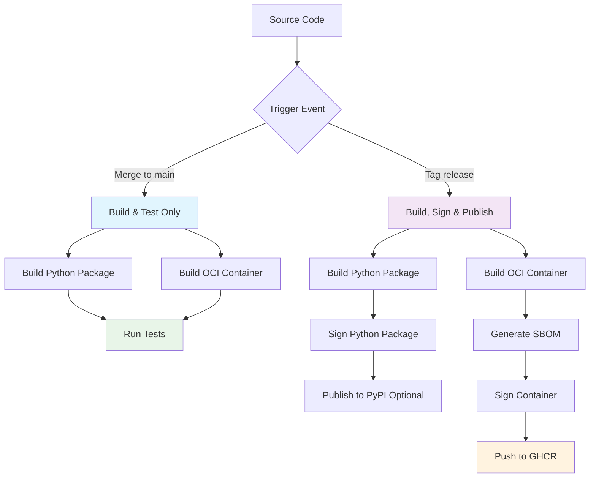

# Ca-Bhfuil Container Packaging Strategy

> **Minimal, secure, and reproducible container packaging strategy**
>
> **Version**: 2.0 | **Last Updated**: 2025-06-24 | **Status**: Design Complete

## Executive Summary

Ca-Bhfuil implements a **streamlined OCI container strategy** using UV for fast builds and Alpine Linux for the runtime with conditional signing and publishing. This approach prioritizes **security**, **performance**, and **maintainability** while providing continuous build validation and release automation.

### Key Objectives
- **🔒 Minimal Attack Surface**: Alpine runtime with non-root user and minimal dependencies
- **📦 OCI Compliance**: Works with Docker, Podman, and any OCI-compatible tool
- **🚀 Fast Builds**: UV for rapid dependency resolution and package building
- **🌍 Multi-Platform**: Primary x86_64 support with ARM64 secondary
- **📋 Basic Security**: Python dependency SBOM and container signing on releases

## Finalized Architecture



## Design Decisions Summary

### Core Technology Choices

| Component | Selected Technology | Rationale |
|-----------|-------------------|-----------|
| **Base Image** | `python:3.12-alpine` | Minimal attack surface, small size, essential tools |
| **Build Strategy** | Multi-stage OCI (UV builder + Alpine runtime) | Fast builds with UV, secure Alpine runtime |
| **Registry** | GitHub Container Registry only | Integrated with repository, no vendor lock-in |
| **Signing** | Cosign with GitHub OIDC | Industry standard, no key management |
| **SBOM** | Syft (Python dependencies only) | Simple, focused scope |
| **Multi-Arch** | x86_64 primary, ARM64 secondary | Matches usage patterns |

### Workflow Strategy

| Event | Build Package | Build Container | Sign Package | Sign Container | Publish |
|-------|--------------|----------------|--------------|----------------|---------|
| **Merge to main** | ✅ | ✅ | ❌ | ❌ | ❌ |
| **Tag release** | ✅ | ✅ | ✅ | ✅ | ✅ |

## Container Build Strategy

### Multi-Stage Dockerfile Design

**Stage 1: Builder (UV-based)**
```dockerfile
FROM ghcr.io/astral-sh/uv:python3.12-alpine as builder
# Install build dependencies (gcc, libgit2-dev, etc.)
# Build Python package with UV for fast dependency resolution
# Compile any native dependencies in virtual environment
```

**Stage 2: Runtime (Alpine-based)**
```dockerfile
FROM python:3.12-alpine as runtime
# Install only runtime dependencies (libgit2, git)
# Copy virtual environment from builder
# Run as nonroot user (UID 65532)
```

### Security Features

1. **Minimal Alpine Runtime**
   - Minimal OS surface area with Alpine Linux
   - Only essential runtime dependencies (libgit2, git)
   - Regular security updates from Alpine team
   - Optimized for container environments

2. **Reproducible Builds**
   - Specific Python version (3.12)
   - UV-based fast and deterministic dependency resolution
   - Locked Python dependencies via uv.lock
   - Multi-stage build process

3. **Non-Root Execution**
   - Custom `nonroot` user (UID 65532)
   - No privilege escalation possible
   - Secure virtual environment isolation

## GitHub Actions Workflow Design

### Shared Build Logic with Conditional Publishing

```yaml
name: Build and Release

on:
  push:
    branches: [main]    # Build & test only
    tags: ['v*']        # Build, sign & publish

env:
  REGISTRY: ghcr.io
  IMAGE_NAME: ${{ github.repository }}

jobs:
  build-python-package:
    runs-on: ubuntu-latest
    steps:
      - uses: actions/checkout@v4

      - name: Install UV
        run: pip install uv

      - name: Build Python Package
        run: uv build

      - name: Upload Package Artifacts
        uses: actions/upload-artifact@v4
        with:
          name: python-packages
          path: dist/

      # Only sign and publish on tags
      - name: Sign Python Packages
        if: startsWith(github.ref, 'refs/tags/')
        run: |
          pip install sigstore
          sigstore sign dist/*.whl dist/*.tar.gz

      - name: Publish to PyPI
        if: startsWith(github.ref, 'refs/tags/')
        uses: pypa/gh-action-pypi-publish@release/v1
        with:
          # Optional: remove if not publishing to PyPI

  build-container:
    runs-on: ubuntu-latest
    permissions:
      contents: read
      packages: write
      id-token: write  # For OIDC signing

    steps:
      - uses: actions/checkout@v4

      - name: Set up Docker Buildx
        uses: docker/setup-buildx-action@v3

      - name: Login to Container Registry
        if: startsWith(github.ref, 'refs/tags/')
        uses: docker/login-action@v3
        with:
          registry: ${{ env.REGISTRY }}
          username: ${{ github.actor }}
          password: ${{ secrets.GITHUB_TOKEN }}

      - name: Extract metadata
        id: meta
        uses: docker/metadata-action@v5
        with:
          images: ${{ env.REGISTRY }}/${{ env.IMAGE_NAME }}
          tags: |
            type=ref,event=branch
            type=ref,event=pr
            type=semver,pattern={{version}}
            type=semver,pattern={{major}}.{{minor}}

      - name: Build Container
        uses: docker/build-push-action@v5
        with:
          context: .
          platforms: linux/amd64  # Start with x86_64 only
          push: ${{ startsWith(github.ref, 'refs/tags/') }}
          tags: ${{ steps.meta.outputs.tags }}
          labels: ${{ steps.meta.outputs.labels }}
          cache-from: type=gha
          cache-to: type=gha,mode=max

      # Only sign and generate SBOM on tags
      - name: Install Cosign & Syft
        if: startsWith(github.ref, 'refs/tags/')
        uses: sigstore/cosign-installer@v3

      - name: Generate SBOM
        if: startsWith(github.ref, 'refs/tags/')
        uses: anchore/sbom-action@v0
        with:
          image: ${{ env.REGISTRY }}/${{ env.IMAGE_NAME }}:${{ steps.meta.outputs.version }}
          format: spdx-json
          output-file: sbom.spdx.json

      - name: Sign Container and Attest SBOM
        if: startsWith(github.ref, 'refs/tags/')
        run: |
          cosign sign --yes ${{ env.REGISTRY }}/${{ env.IMAGE_NAME }}:${{ steps.meta.outputs.version }}
          cosign attest --yes --predicate sbom.spdx.json ${{ env.REGISTRY }}/${{ env.IMAGE_NAME }}:${{ steps.meta.outputs.version }}
```

## SBOM and Security Strategy

### Python Dependency SBOM

The SBOM generation focuses on Python dependencies to keep complexity minimal:

**Included in SBOM:**
- Python packages from `pyproject.toml`
- Transitive dependencies from `uv.lock`
- Python interpreter version
- Build environment metadata

**Not Included (initially):**
- System packages (Alpine builder dependencies)
- OS-level libraries
- Build tools

### Container Signing with Cosign

**Signing Approach:**
- Use GitHub OIDC tokens (no key management)
- Sign container images on tag releases only
- Attach SBOM as attestation to container
- Verify signatures with GitHub identity

**Verification:**
```bash
# Verify container signature
cosign verify --certificate-identity-regexp=".*" \
  --certificate-oidc-issuer="https://token.actions.githubusercontent.com" \
  ghcr.io/seanmooney/ca-bhfuil:v1.0.0

# Verify SBOM attestation
cosign verify-attestation --type spdxjson \
  --certificate-identity-regexp=".*" \
  --certificate-oidc-issuer="https://token.actions.githubusercontent.com" \
  ghcr.io/seanmooney/ca-bhfuil:v1.0.0
```

## Local Development and Testing

### Building Containers Locally

```bash
# Build with Docker
docker build -t ca-bhfuil:local .

# Build with Podman  
podman build -t ca-bhfuil:local .

# Build with any OCI-compatible tool
buildah build -t ca-bhfuil:local .
```

### Testing Locally

```bash
# Test the container
docker run --rm ca-bhfuil:local --version
docker run --rm ca-bhfuil:local --help

# Generate local SBOM for testing
syft packages ca-bhfuil:local -o spdx-json=local-sbom.json

# Test with different architectures (if buildx available)
docker buildx build --platform linux/amd64,linux/arm64 -t ca-bhfuil:multiarch .
```

### Debugging

Since the final image is Alpine-based, debugging is straightforward:

```bash
# Debug the runtime image directly
docker run -it --rm --entrypoint sh ca-bhfuil:local

# Or inspect the builder stage
docker build --target builder -t ca-bhfuil:debug .
docker run -it --rm ca-bhfuil:debug sh

# Check installed packages
docker run --rm ca-bhfuil:local sh -c "pip list"
```

## Implementation Roadmap

### Phase 1: Basic Container Build (Week 1) ✅ COMPLETE
- [x] Create UV + Alpine-based Dockerfile
- [x] Set up GitHub Actions workflow with conditional logic
- [x] Implement basic multi-stage build (UV builder → Alpine runtime)
- [x] Test local builds with Docker and Podman
- [x] Verify containers run correctly

### Phase 2: Security and Signing (Week 2) ✅ COMPLETE
- [x] Add Cosign container signing for tagged releases
- [x] Implement SBOM generation with Syft
- [x] Set up Python package signing with sigstore
- [x] Configure GitHub OIDC for keyless signing
- [x] Test signature verification

### Phase 3: Multi-Architecture Support (Week 3)
- [ ] Add ARM64 build support
- [ ] Test on Apple Silicon Macs
- [ ] Optimize build times for multi-arch
- [ ] Verify all signatures work across architectures

### Phase 4: Documentation and Automation (Week 4)
- [ ] Complete documentation for users and contributors
- [ ] Set up automated dependency updates
- [ ] Create container usage examples
- [ ] Add monitoring and alerts for failed builds

## File Changes Required

### New Files
- [x] `.github/workflows/build-and-release.yml` - Main workflow
- [x] `Dockerfile` - Replace current with UV + Alpine version
- [x] `docs/CONTAINER_USAGE.md` - User documentation

### Modified Files  
- [ ] `README.md` - Add container usage instructions
- [ ] `.dockerignore` - Optimize for new build process
- [ ] `docs/DEVELOPMENT.md` - Update with container testing info

### Removed Files
- [ ] `Dockerfile.dev` - Remove development container
- [ ] `docker-compose.yml` - Simplify to single production service

## Success Criteria

### Build Verification
- ✅ Containers build successfully on every merge
- ✅ Containers run ca-bhfuil CLI correctly
- ✅ Multi-architecture builds work (x86_64 + ARM64)
- ✅ Compatible with Docker, Podman, and other OCI tools

### Security Verification  
- ✅ Containers are signed on tagged releases
- ✅ SBOM generation works and includes Python dependencies
- ✅ Signatures can be verified with GitHub identity
- ✅ Non-root execution with minimal runtime dependencies

### Workflow Verification
- ✅ Builds run on merge (no publish)
- ✅ Full pipeline runs on tags (build + sign + publish)
- ✅ Local builds match CI builds
- ✅ Clear feedback on build failures

---

**Ready to implement secure, minimal containers with streamlined CI/CD!** 🚀

*This strategy provides maximum security with minimal complexity, focusing on the 80/20 rule for container packaging.*
